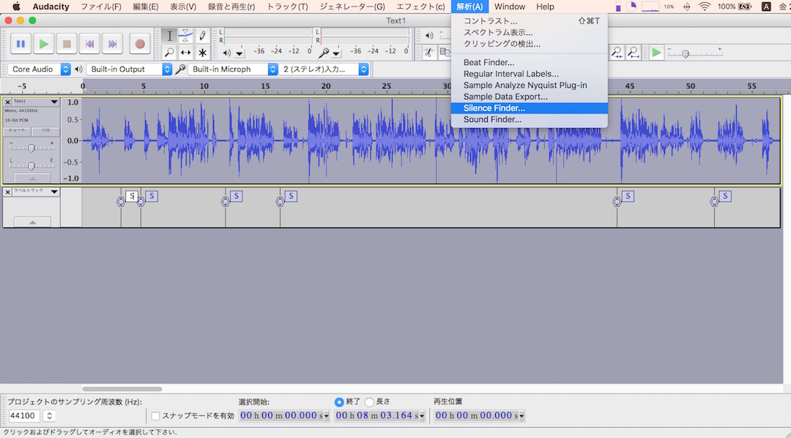
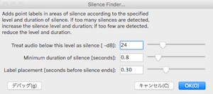
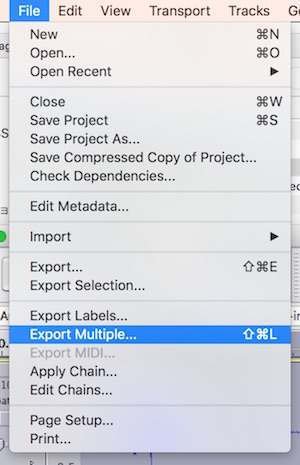
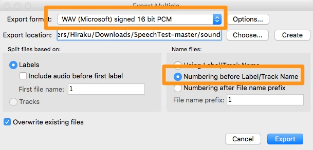
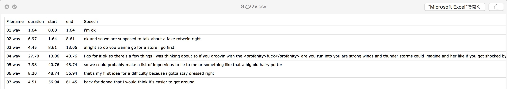

# BingSpeechRecognition

### About
This project includes two parts: 

1. Text to Speech Conversion
2. Speech to Text Conversion

However, to help transcribing voice recording to text easier, the main propose of this project is generating a well-organized file that includes each sentence of yoru voice recording files.

### Requirements
* Python 3
* Speech API token of Microsoft Project Oxford

### Tokens
Save your API and tokens in `tokens_sample.py` and rename it to `tokens.py`

### Text to Speech Conversion

In this part, we use Speech API of Microsoft Project Oxford to synthesize the voice from text inputs. You can [subscribe a free plan](https://www.projectoxford.ai/Subscription/Index?productId=/products/54f0354049c3f70a50e79b7e) of Speech APIs, which includes 5000 free API calls per month.

Usage: 
`python synthesizer.py "Never gonna give you up, never gonna let you down."` 

Output: `synthesized.wav`

### Speech to Text Recognition

In this part, we should get [Bing Voice Recognition](https://datamarket.azure.com/dataset/bing/speechrecognition) token, like Speech API, you can call 5000 times for free per month. Then you can access your keys from [this page](https://datamarket.azure.com/account/keys)

Since Bing Voice Recognition service can't recognition our voice recoding file at once, we should separate the file to mutiple parts first. We suggest the tool [Audacity](http://sourceforge.net/projects/audacity/) for track editing. 

#### Separate Voice Recording File

* Open your file with Audicity and choose "Analyze → Silence Finder..."

* Change the settings, then press "OK"

 

* Click "File → Export Multiple..."

* Check export format and name files as the following settings, then export all files to same directory

#### Usage

Put all .wav files in same directory, then use `python recognizer.py FOLDERNAME` to generate results.

#### Results

The output of recognizer.py is a .csv file which includes all sentences in your voice recoding files. Each row represent the corresponding output of the voice recording. If the recoginition failed, the output file also represents the reason and error code.

